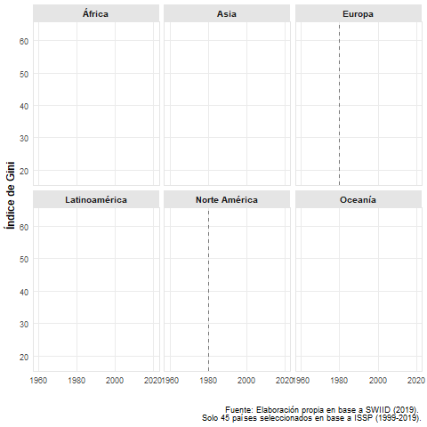
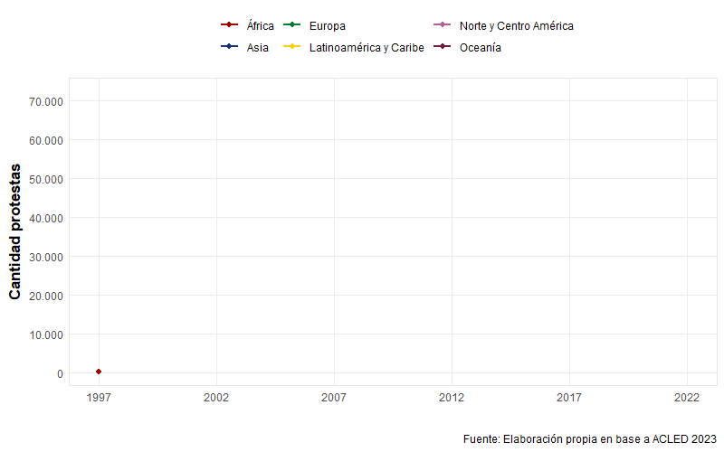
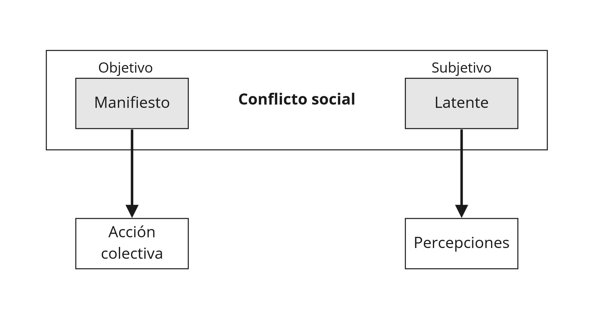
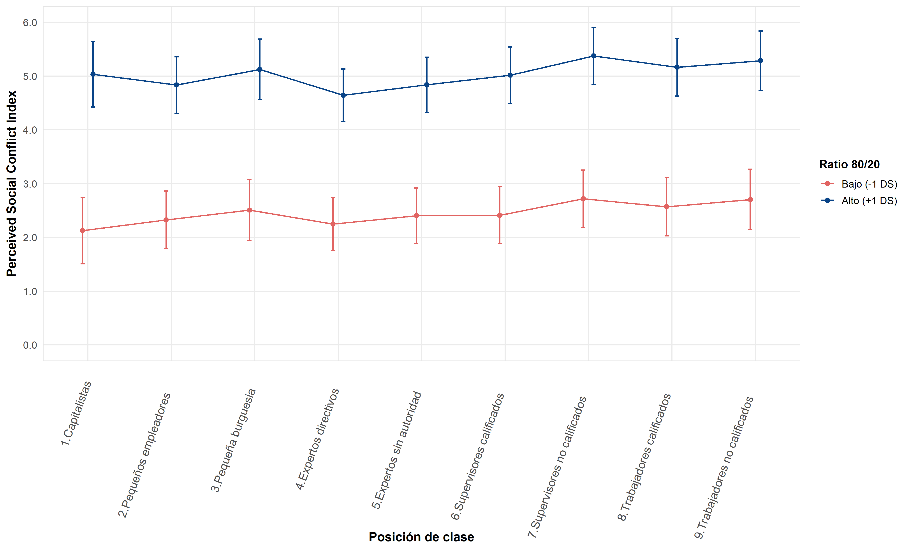

```{r database, message=TRUE, warning=TRUE, include=FALSE, paged.print=TRUE}

if (!require("pacman")) install.packages("pacman")

pacman::p_load(tidyverse, sjmisc, kableExtra, sjPlot,
               summarytools, DT, lme4, easystats, gtsummary, 
               stargazer, magrittr, htmlTable, gridExtra,
               influence.ME, janitor, lessR, ggrepel, ggpubr,
               performance, ggrepel, ggthemes, flexplot,
               sjlabelled, RColorBrewer, stats, car, texreg,
               scales, GGally, broom, table1, cowplot, ggeffects,knitr)

options(scipen=999)

load(url("https://github.com/Andreas-Lafferte/tesis/raw/main/output/data/db-proc.RData"))
load(url("https://github.com/Andreas-Lafferte/tesis/raw/main/output/data/df2-proc.RData"))

```

```{r include=FALSE}

table_format = if(is_html_output()) {
  "html"
} else if(is_latex_output()) {
  "latex"
}
table_format2 = if(is_html_output()) {
  T
} else if(is_latex_output()) {
  F
}

```

```{r setup, include=FALSE, eval=TRUE}
knitr::opts_chunk$set(comment=NA, prompt=FALSE, cache=FALSE, echo=TRUE, results='asis', message = F, warning = F)

options(htmltools.dir.version = FALSE)

summarytools::st_options(bootstrap.css     = FALSE,
           plain.ascii       = FALSE,   
           style             = "rmarkdown",
           dfSummary.silent  = TRUE, 
           footnote          = NA,
           subtitle.emphasis = FALSE,
           headings =  F,
           lang =  "es")

summarytools::st_css()

options(kableExtra.html.bsTable = T)

options(knitr.kable.NA = '')

reset_gtsummary_theme()
theme_gtsummary_journal(journal = "jama")
#> Setting theme `JAMA`
theme_gtsummary_compact()
#> Setting theme `Compact`
theme_gtsummary_language(language = "es", decimal.mark = ".", big.mark = ",", set_theme = T)

formatter <- function(...){
  function(x) format(round(x, 1), ...)
}

windowsFonts(`Roboto Condensed` = windowsFont("Roboto Condensed"))

my_pretty_theme <- theme_minimal(base_family = "Roboto Condensed", base_size = 10) +
  theme(panel.grid.minor = element_blank(),
        # Bold, bigger title
        plot.title = element_text(face = "bold", size = rel(1.7)),
        # Plain, slightly bigger subtitle that is grey
        plot.subtitle = element_text(face = "italic", size = rel(0.85), color = "grey30"),
        # Italic, smaller, grey caption that is left-aligned
        plot.caption = element_text(face = "italic", size = rel(0.7), 
                                    color = "grey70", hjust = 0),
        # Bold legend titles
        legend.title = element_text(face = "bold", size = rel(0.7)),
        # Bold, slightly larger facet titles that are left-aligned for the sake of repetition
        strip.text = element_text(face = "bold", size = rel(0.7), hjust = 0.5),
        # Bold axis titles
        axis.title = element_text(face = "bold", size = rel(0.85)),
        # Add some space above the x-axis title and make it left-aligned
        axis.title.x = element_text(margin = margin(t = 5)),
        # Add some space to the right of the y-axis title and make it top-aligned
        axis.title.y = element_text(margin = margin(r = 5)),
        # Add a light grey background to the facet titles, with no borders
        strip.background = element_rect(fill = "grey90", color = NA),
        # Add a thin grey border around all the plots to tie in the facet titles
        panel.border = element_rect(color = "grey90", fill = NA))

```

```{r xaringanExtra, echo=FALSE}
xaringanExtra::use_xaringan_extra(c("tile_view", "share_again", "scribble"))
```


```{r, message=FALSE, warning=FALSE, include=FALSE, results='asis'}

# Null model
model_0 <- lmer(PSCi ~ 1 + (1 | COUNTRY), 
                data = db, weights = FACTOR, REML = T)

performance::icc(model_0, by_group = T)
## ICC Country = 0.217
## ICC Individual = 0.783


# Influence test
inf_m0 <- influence(model_0, group = "COUNTRY")

# D cook
cooks.distance(inf_m0) # cut point is 4/33 = 0.1212121

plot(inf_m0, which="cook",
     cutoff=0.121, sort=TRUE,
     xlab="Distancia de Cook",
     ylab="País", width=60, height=40)

# Influential countries: South Korea and Hungary. 
# This are the two countries with the highest average PSCi in the sample.


# Model 1: Only Class
model_1 <- lmer(PSCi ~ 1 + CLASS +
                  (1 | COUNTRY), data = db, weights = FACTOR, REML = T)

# Model 2: Class + Union
model_2 <- lmer(PSCi ~ 1 + CLASS + UNION +
                  (1 | COUNTRY), data = db, weights = FACTOR, REML = T)

# Model 3: Class + Union + Ratio + CorpAll + WAVE
model_3 <- lmer(PSCi ~ 1 + CLASS + UNION + C_RATIO + CorpAll + WAVE +
                  (1 | COUNTRY), data = db, weights = FACTOR, REML = T)

# Model 4: Class + Union + Ratio + CorpAll + WAVE + Controls N1 & N2
model_4 <- lmer(PSCi ~ 1 + CLASS + UNION + C_RATIO + CorpAll + WAVE +
                  (C_AGE)^2 + SEX + IDEOLOGY + C_SOCEXPEND +
                  (1 | COUNTRY), data = db, weights = FACTOR, REML = T)

# Model 5: Class + Union + Ratio + CorpAll + WAVE + Controls N1 & N2 + Random Slope CLASS
model_5 <- readRDS("~/GitHub/tesis/output/model_5.rds")

# Model 6: Class + Union + Ratio + CorpAll + WAVE + Controls N1 & N2 + Random Slope CLASS + Interaction
model_6 <- readRDS("~/GitHub/tesis/output/model_6.rds")


## Extract for table
model_2.e <- texreg::extract(model = model_2, include.deviance = T, include.loglik = F,
                     include.variance = F)

model_3.e <- texreg::extract(model = model_3, include.deviance = T, include.loglik = F,
                     include.variance = F)

model_4.e <- texreg::extract(model = model_4, include.deviance = T, include.loglik = F,
                     include.variance = F)

model_6.e <- readRDS("~/GitHub/tesis/output/model_6e.rds")

```


class: middle hide-logo title

.pull-left-narrow[
.espaciosimple[
.tiny[]
]


<br><br><br><br><br>
]

.pull-right-wide[
.right[

.content-box-red[
.center[

## Ellos contra nosotros: las percepciones del conflicto social

.medium[

### Un análisis comparado de sus determinantes
]
]
]

.medium[.red[#### Examen para optar al título de Sociólogo]]


----
.espaciosimplelineas[

.medium[.bold[Andreas Lafferte Tamayo]] .tiny[.blue[(_andreas.laffert@ug.uchile.cl_)]]

]


.small[
Facultad de Ciencias Sociales, Universidad de Chile
]
.small[
Enero, Santiago.

  ]

]
]

</br>
.left.tiny[Profesor Guía: Dr. Juan Carlos Castillo </br>
Comisión:  ]
---
class: inverse middle center, slideInRight

.medium[ 
### Estructura de presentación
]


.medium[ 
1. Introducción
2. Datos, variables y métodos
3. Resultados
4. Discusión y conclusiones
5. Respuesta a comentarios
]


---

layout: true
class: animated, fadeIn
---
class: inverse middle center, slideInRight
background-size: 12%
background-position: 99% 1%

## 1. Introducción

---

## Contexto y motivación

--

Aumento de la **desigualdad económica** y de la concentración de la riqueza .tiny[*(Chancel et al., 2022)*]


.center[

]


---

## Contexto y motivación

--
.medium[

* Resurgimiento de la conflictividad social: **tiempos contenciosos** .tiny[*(Della Porta et al. 2017)*]
]

.medium[
* Re-politización de las desigualdes y **revitalización de clivajes verticales** .tiny[*(Blühdorn & Deflorian, 2021; Della Porta, 2015)*]
]


.center[

]

---

## Contexto y motivación

--

Creciente interés en el **estudio del conflicto social** .tiny[*(cf. Almeida & Cordero Ulate, 2015; Della Porta et al., 2017; Karakoc, 2013)*]

--


**Implicancias subjetivas** del conflicto: percepciones, actitudes y valores .tiny[*(cf. Hadler, 2017; Hertel & Schöneck, 2019; Kelley & Evans, 1995)*]


.center[

]


---

## Problema de investigación

--

De acuerdo con esta línea investigativa, uno de los principales problemas asociados a dicha polarización son las **percepciones subjetivas del conflicto**.

--
  

Horizontales y **verticales** 
--

### Definición 

.content-box-red[

_La percepción de conflicto social se refiere a cómo los sujetos captan/describen un conflicto social determinado entre dos grupos verticalmente organizados .tiny[(Hertel & Schöneck, 2019, p.2)]_

]


---

## Explicaciones desde la literatura

<div style="text-align: justify">

--
</br>

* .bold[Percibir mayores desigualdades] económicas y .bold[auto-ubicarse] en las posiciones más bajas de la estructura social se asocian con mayor percepción de conflicto .tiny[*(Hadler, 2017)*]

--
</br>

* Las .bold[creencias sobre la estratificación] de las sociedades mediatiza efecto de diversos factores en el conflicto percibido .tiny[*(Hertel and Schöneck, 2019; Kelley & Evans, 1995)*]

--
</br>

* La .bold[participación en organizaciones sociopolíticas] tiene un efecto potenciador en el conflicto percibido y en la participación de acciones contenciosas .tiny[*(Hadler, 2003; Kerrissey & Schofer, 2018; Ringqvist, 2020)*]

--
</br>

* La .bold[desigualdad económica] incrementa la percepción de conflicto, mientras que en países con .bold[Estados de Bienestar más extensos] se perciben menos tensiones .tiny[*(cf. Edlund & Lindh, 2015; Hadler, 2017)*]


---

## Problematización

.pull-left-wide[
.content-box-red[
1..bold[Ausencia del análisis de clase] en investigaciones más recientes. Ampliar relación empiríca entre la percepción *general* de conflictos y otros esquemas de clase]
]

--

.pull-right-wide[
.content-box-red[
2.La pregunta sobre cómo el nivel de .bold[desigualdad económica] de los países puede .bold[moderar] el efecto de la .bold[clase social] en el conflicto percibido es aún incierta
]
]

--

</br></br>

.pull-left-wide[

.xlarge[.bold[Este estudio...]]
]


---
class: roja, middle center
 
## Pregunta de investigación 

<div style="text-align: justify">


.xlarge[


.bold[*¿En qué medida la .black[clase social] afecta a las .black[percepciones de conflicto social] y cómo esta relación cambia a partir del rol del .black[contexto económico e institucional] entre 1999-2019?*]
]


---
## Antecedentes e hipótesis


$H_{1}$: Individuos de clases subordinadas tenderán a percibir mayor conflicto social que individuos de clases privilegiadas .tiny[*(Edlund & Lindh, 2015; Pérez, 2022; Wright, 1997)*]


$H_{2}$:Individuos miembros de sindicatos tenderán a percibir mayor conflicto social que individuos que no lo son .tiny[*(Ringqvist, 2020; Kerrissey & Schofer, 2018)*]


.center[

]
 
---
## Antecedentes e hipótesis


$H_{3a}$: Mayores niveles de desigualdad económica aumentarán las percepciones de conflicto social en los individuos .tiny[*(Hadler, 2017; Hertel & Schöneck, 2019; Karakoc, 2013)*]


$H_{4}$: Mayores niveles de corporativismo disminuirán las percepciones de conflicto social en los individuos. .tiny[*(Ringqvist, 2020; Pérez, 2022)*]

.center[

]

---
## Antecedentes e hipótesis


$H_{3b}$: A mayores niveles de desigualdad económica, los individuos de clase trabajadora aumentarán su percepción de conflicto social, mientras que individuos de clase capitalista mantendrán o disminuirán su percepción de conflicto social .tiny[*(Andersen & Curtis, 2015; Della Porta, 2015; Haddon & Wu, 2021)*]


.center[

]


---
class: inverse middle center, slideInRight
background-size: 12%
background-position: 99% 1%

## 2. Datos, variables y métodos

---


## Datos y método

<div style="text-align: justify">

--


.large[

.dat[
### Datos
]

Módulo de Desigualdad Social de la [International Social Survey Programme (ISSP)](https://www.gesis.org/en/issp/modules/issp-modules-by-topic/social-inequality) en sus olas de 1999 (*N* = 6.175), 2009 (*N* = 21.932) y 2019 (*N* = 11.746) además de otras fuentes de datos como  [OCDE](https://data.oecd.org/economy.htm#profile-GDP%20and%20spending), [WIID](https://www.wider.unu.edu/database/world-income-inequality-database-wiid#WIIDcomp) e [ICTWSS](https://www.ictwss.org/). Muestra final compuesta por 39.853 individuos (nivel 1) anidados en 33 países (nivel 2).
]
--


.large[

.dat[
### Método
]

Modelos de regresión multinivel en series de tiempo o tendencia para 33 países entre 1999/2009/2019.

.center[
.bold[Modelo]:

$PSCi_{ij} = \beta_{0} + \beta_{1}X_{ij} + \beta_{2}Z_{j} + \beta_{3}X_{ij}{Z}_{j} +$
$u_{0j} + u_{1j}X_{ij} + e_{ij}$
]

]
---
## Variable dependiente 


<div style="text-align: justify">

.large[
.bold[Perceived Social Conflict Index] - $PSCi$: índice sumativo de tres indicadores sobre la percepción de conflictos. Sus valores oscilan entre 0 a 9 ( $\alpha$ = 0.83), *M* = 3.78, *DE* = 2.03.

]

.center[

]


---
## Variables independientes

<div style="text-align: justify">
.pull-left[

.large[
**Nivel individual**

- .bold[Posición de clase]: versión modificada de 9 categorías del esquema de clases de Erik Olin Wright (1997).

</br>

- .bold[Afiliación sindical]: *dummy* (0 = no miembro de sindicato, 1 = miembro de sindicato).


]
]

.pull-right[

.center[

]
]

---
## Variables independientes

<div style="text-align: justify">

.pull-left[

.large[
**Nivel contextual (país-año)**

- .bold[Desigualdad económica]: ratio inter quintil S80/S20 sobre el ingreso familiar disponible post transferencias y post impuestos (concentración económica).

- .bold[Nivel de corporativismo]: índice desarrollado por Jahn (2016) a partir de Visser (2019) ICTWSS. 

- .bold[Tiempo]: año de aplicación de la encuesta (1999, 2009 o 2019)

]
]

.pull-right[

.center[

]
]


---
## Controles

<div style="text-align: justify">

.pull-left[

.large[
**Nivel individual**

- Edad (en años)
- Sexo (*dummy* 0 = hombre, 1 = mujer)
- Identificación política (*nominal politómica* izquierda, centro, derecha y sin identificación)

**Nivel contextual**

- Producto Interno Bruto (GDP) per cápita
- Gasto social como proporción del GDP

]
]

.pull-right[

.center[

]
]
---
class: inverse middle center, slideInRight
background-size: 12%
background-position: 99% 1%

## 3. Resultados

---
### Descriptivos - Evolución percepciones conflicto social 1999-2019


.center[

]


---
## Modelos - Interceptos aleatorios

.center[

]


---
## Modelos - Interceptos aleatorios

.center[


]

.left.tiny[
.bold[
H1: ✓
]]


.footnote[Modelo 1 (FE-nivel individual). ∗∗∗ p < 0.01; ∗∗ p < 0.05; ∗ p < 0.1 ]

---
## Modelos - Interceptos aleatorios

.center[


]

.left.tiny[
.bold[
H1: ✓
H2: ✓
]

]


.footnote[Modelo 1 (FE-nivel individual). ∗∗∗ p < 0.01; ∗∗ p < 0.05; ∗ p < 0.1 ]


---
## Modelos - Interceptos aleatorios

.center[


]

.left.tiny[
.bold[
H1: ✓
H2: ✓
H3a: ✓
]

]

.footnote[Modelo 2 (FE-nivel individual y contextual). ∗∗∗ p < 0.01; ∗∗ p < 0.05; ∗ p < 0.1 ]

---
## Modelos - Interceptos aleatorios

.center[


]

.left.tiny[
.bold[
H1: ✓
H2: ✓
H3a: ✓
H4: ✓
]

]

.footnote[Modelo 2 (FE-nivel individual y contextual). ∗∗∗ p < 0.01; ∗∗ p < 0.05; ∗ p < 0.1 ]

---
## Modelos - Interacciones entre niveles

.center[


]

.left.tiny[
.bold[
H1: ✓
H2: ✓
H3a: ✓
H3b: ✗
H4: ✓
]

]

.footnote[Modelo 4 (FE-RE, incluye controles). ∗∗∗ p < 0.01; ∗∗ p < 0.05; ∗ p < 0.1 ]

---
## Modelos - Interacciones entre niveles

.center[


]


---
class: inverse middle center, slideInRight
background-size: 12%
background-position: 99% 1%

## 4. Discusión y conclusiones

---
## Discusión

<div style="text-align: justify">
</br>
.left-column[
### Posición de clase
]
.right-column[

]

---
## Discusión
<div style="text-align: justify">
</br>
.left-column[
### Posición de clase
</br>
### Membresía sindical
]
</br>
.right-column[

]
---
## Discusión
<div style="text-align: justify">
</br>
.left-column[
### Posición de clase
</br>
### Membresía sindical
</br>
### Desigualdad económica
]
</br></br>
.right-column[


]

---
## Discusión

<div style="text-align: justify">
</br>
.left-column[
### Clase y desigualdad
]
.right-column[

]

---
## Discusión

<div style="text-align: justify">
</br>
.left-column[
### Clase y desigualdad
</br>
### Corporativismo
]
.right-column[

]

---
class: roja
 
## Conclusiones

<div style="text-align: justify">

--
1. X

--

2. Y

--

3. K


---
class: inverse middle center, slideInRight
background-size: 12%
background-position: 99% 1%

## 5. Respuesta a comentarios

---
class: center middle hide-logo
background-size: 12%
background-position: 99% 1%

.final[
# ¡Gracias por su atención!
]

<br>

----
.espaciosimplelineas[
 Andreas Lafferte Tamayo - andreas.laffert@ug.uchile.cl<br>
 
 [Tesis abierta](https://github.com/Andreas-Lafferte/tesis)

.light[Facultad de Ciencias Sociales, Universidad de Chile<br>
Enero, 2023]

]

---
### Referencias

---
class: inverse middle center, slideInRight
background-size: 12%
background-position: 99% 1%

## 6. Anexos

---
### Descriptivos

.center[


]

---
### Descriptivos

.center[


]


---
### Descriptivos

.center[


]

---
### Modelos

.center[


]

.footnote[∗∗∗ p < 0.01; ∗∗ p < 0.05; ∗ p < 0.1 ]

---
### Modelos

.center[


]

.footnote[∗∗∗ p < 0.01; ∗∗ p < 0.05; ∗ p < 0.1 ]

---
### Modelos

.center[


]


.footnote[∗∗∗ p < 0.01; ∗∗ p < 0.05; ∗ p < 0.1 ]


---
### Modelos 

.center[


]


.footnote[∗∗∗ p < 0.01; ∗∗ p < 0.05; ∗ p < 0.1 ]

---
### Ajuste modelos

</br>

```{r fit, echo=FALSE, message=FALSE, warning=FALSE, cache=TRUE, results='asis'}

res_anova <- readRDS("~/GitHub/tesis/output/deviancetest.rds")

fit_tab <- res_anova[c(2,3,5,6,7)] %>% as.tibble(.)

fit_tab$mod <- c("Modelo 0", "Modelo 1", "Modelo 2", "Modelo 3", "Modelo 4")
fit_tab$p <- c(" ","< 0.001 ***", "< 0.001 ***", "< 0.001 ***", "< 0.01 **")
fit_tab$Chisq <- round(fit_tab$Chisq, digits = 2)

fit_tab <- fit_tab %>% select(mod, AIC, BIC, deviance, Chisq, Df, p)

colnames <- c("Modelo", "AIC", "BIC", "Deviance", "$\\chi^2$", "Df", "p-value")

fit_tab <- kableExtra::kable(fit_tab, format = "html", col.names = colnames, row.names = F,
                  booktabs = T, caption = "Estadísticos de bondad de ajuste") %>% 
  kableExtra::kable_styling(latex_options = "hold_position", font_size = 16, position = "center") %>%
   kableExtra::kable_styling(bootstrap_options = c("striped", "hover", "condensed", "responsive"), full_width = T) %>% 
  footnote(number = c("Modelo 0 refiere al modelo nulo o sin predictores"))

fit_tab

```

---
### Matriz correlaciones

.center[

]

---
### Supuestos: multicolinealidad


.center[


]


