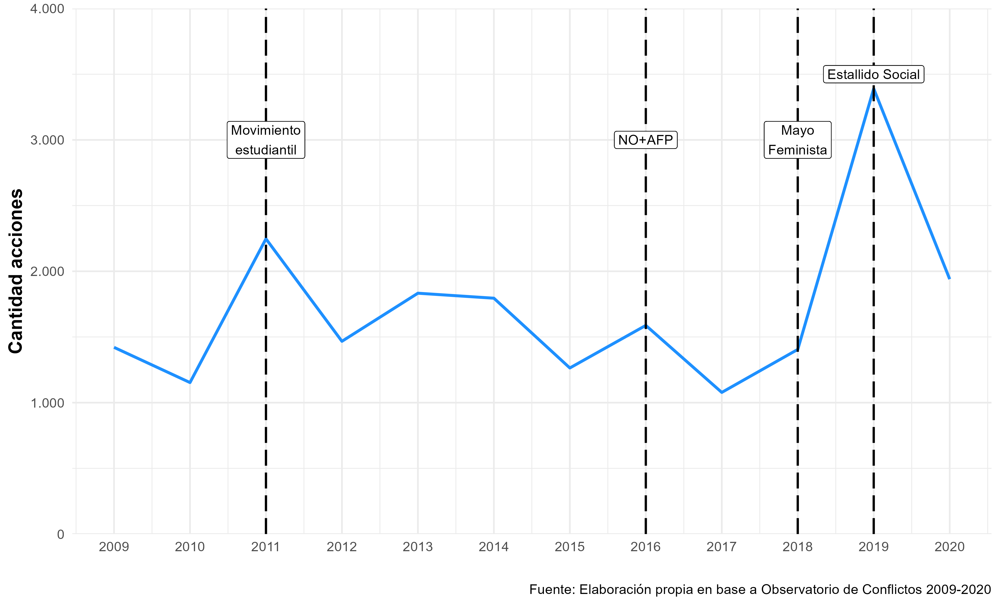
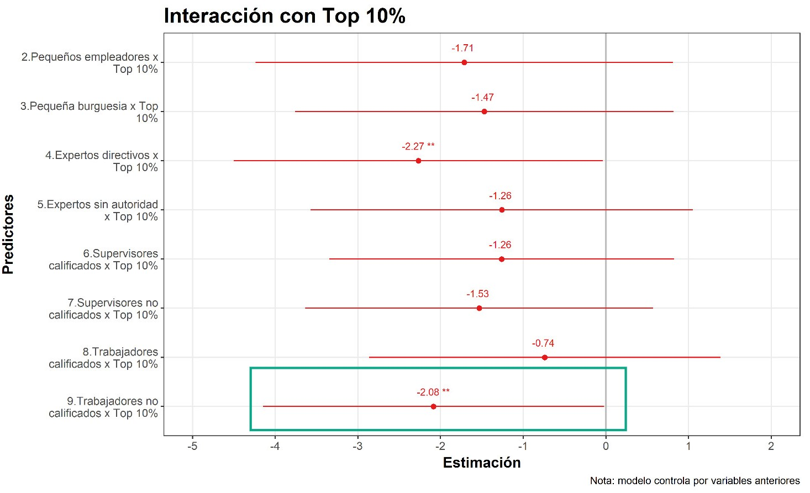

```{r database, message=TRUE, warning=TRUE, include=FALSE, paged.print=TRUE}

if (!require("pacman")) install.packages("pacman")

pacman::p_load(tidyverse, sjmisc, kableExtra, sjPlot,
               summarytools, DT, lme4, easystats, gtsummary, 
               stargazer, magrittr, htmlTable, gridExtra,
               influence.ME, janitor, lessR, ggrepel, ggpubr,
               performance, ggrepel, ggthemes, flexplot,
               sjlabelled, RColorBrewer, stats, car, texreg,
               scales, GGally, broom, table1, cowplot, ggeffects,
               knitr, icons)

options(scipen=999)

load(url("https://github.com/Andreas-Lafferte/tesis/raw/main/output/data/db-proc.RData"))
load(url("https://github.com/Andreas-Lafferte/tesis/raw/main/output/data/df2-proc.RData"))

```

```{r include=FALSE}

table_format = if(is_html_output()) {
  "html"
} else if(is_latex_output()) {
  "latex"
}
table_format2 = if(is_html_output()) {
  T
} else if(is_latex_output()) {
  F
}

```

```{r setup, include=FALSE, eval=TRUE}
knitr::opts_chunk$set(comment=NA, prompt=FALSE, cache=FALSE, echo=TRUE, results='asis', message = F, warning = F)

options(htmltools.dir.version = FALSE)

summarytools::st_options(bootstrap.css     = FALSE,
           plain.ascii       = FALSE,   
           style             = "rmarkdown",
           dfSummary.silent  = TRUE, 
           footnote          = NA,
           subtitle.emphasis = FALSE,
           headings =  F,
           lang =  "es")

summarytools::st_css()

options(kableExtra.html.bsTable = T)

options(knitr.kable.NA = '')

reset_gtsummary_theme()
theme_gtsummary_journal(journal = "jama")
#> Setting theme `JAMA`
theme_gtsummary_compact()
#> Setting theme `Compact`
theme_gtsummary_language(language = "es", decimal.mark = ".", big.mark = ",", set_theme = T)

formatter <- function(...){
  function(x) format(round(x, 1), ...)
}

windowsFonts(`Roboto Condensed` = windowsFont("Roboto Condensed"))

my_pretty_theme <- theme_minimal(base_family = "Roboto Condensed", base_size = 10) +
  theme(panel.grid.minor = element_blank(),
        # Bold, bigger title
        plot.title = element_text(face = "bold", size = rel(1.7)),
        # Plain, slightly bigger subtitle that is grey
        plot.subtitle = element_text(face = "italic", size = rel(0.85), color = "grey30"),
        # Italic, smaller, grey caption that is left-aligned
        plot.caption = element_text(face = "italic", size = rel(0.7), 
                                    color = "grey70", hjust = 0),
        # Bold legend titles
        legend.title = element_text(face = "bold", size = rel(0.7)),
        # Bold, slightly larger facet titles that are left-aligned for the sake of repetition
        strip.text = element_text(face = "bold", size = rel(0.7), hjust = 0.5),
        # Bold axis titles
        axis.title = element_text(face = "bold", size = rel(0.85)),
        # Add some space above the x-axis title and make it left-aligned
        axis.title.x = element_text(margin = margin(t = 5)),
        # Add some space to the right of the y-axis title and make it top-aligned
        axis.title.y = element_text(margin = margin(r = 5)),
        # Add a light grey background to the facet titles, with no borders
        strip.background = element_rect(fill = "grey90", color = NA),
        # Add a thin grey border around all the plots to tie in the facet titles
        panel.border = element_rect(color = "grey90", fill = NA))

my_pretty_theme2 <- theme_bw(base_family = "Roboto Condensed", base_size = 14) +
  theme(panel.grid.minor = element_blank(),
        # Bold, bigger title
        plot.title = element_text(face = "bold", size = rel(1.7)),
        # Plain, slightly bigger subtitle that is grey
        plot.subtitle = element_text(face = "italic", size = rel(0.85), color = "grey30"),
        # Italic, smaller, grey caption that is left-aligned
        plot.caption = element_text(size = 12, 
                                    hjust = 1),
        # Bold legend titles
        legend.title = element_text(face = "bold", size = rel(1.1)),
        # Bold, slightly larger facet titles that are left-aligned for the sake of repetition
        strip.text = element_text(face = "bold", size = rel(0.7), hjust = 0.5),
        # Bold axis titles
        axis.title = element_text(face = "bold", size = rel(1.2)),
        # Add some space above the x-axis title and make it left-aligned
        axis.title.x = element_text(margin = margin(t = 5)),
        # Add some space to the right of the y-axis title and make it top-aligned
        axis.title.y = element_text(margin = margin(r = 5)),
        # Add a light grey background to the facet titles, with no borders
        strip.background = element_rect(fill = "grey90", color = NA),
        # Add a thin grey border around all the plots to tie in the facet titles
        panel.border = element_rect(color = "grey20", fill = NA),
        legend.text = element_text(size = 12),
        axis.text.x = element_text(size = 13),
        axis.text.y = element_text(size = 13))
```


```{r, message=FALSE, warning=FALSE, include=FALSE, results='asis'}

# Null model
model_0 <- lmer(PSCi ~ 1 + (1 | COUNTRY), 
                data = db, weights = FACTOR, REML = T)

performance::icc(model_0, by_group = T)
## ICC Country = 0.217
## ICC Individual = 0.783


# Influence test
inf_m0 <- influence(model_0, group = "COUNTRY")

# D cook
cooks.distance(inf_m0) # cut point is 4/33 = 0.1212121

plot(inf_m0, which="cook",
     cutoff=0.121, sort=TRUE,
     xlab="Distancia de Cook",
     ylab="País", width=60, height=40)

# Influential countries: South Korea and Hungary. 
# This are the two countries with the highest average PSCi in the sample.


# Model 1: Only Class
model_1 <- lmer(PSCi ~ 1 + CLASS +
                  (1 | COUNTRY), data = db, weights = FACTOR, REML = T)

# Model 2: Class + Union
model_2 <- lmer(PSCi ~ 1 + CLASS + UNION +
                  (1 | COUNTRY), data = db, weights = FACTOR, REML = T)

# Model 3: Class + Union + Ratio + CorpAll + WAVE
model_3 <- lmer(PSCi ~ 1 + CLASS + UNION + C_RATIO + CorpAll + WAVE +
                  (1 | COUNTRY), data = db, weights = FACTOR, REML = T)

# Model 4: Class + Union + Ratio + CorpAll + WAVE + Controls N1 & N2
model_4 <- lmer(PSCi ~ 1 + CLASS + UNION + C_RATIO + CorpAll + WAVE +
                  (C_AGE)^2 + SEX + IDEOLOGY + C_SOCEXPEND +
                  (1 | COUNTRY), data = db, weights = FACTOR, REML = T)

# Model 5: Class + Union + Ratio + CorpAll + WAVE + Controls N1 & N2 + Random Slope CLASS
model_5 <- readRDS("~/GitHub/tesis/output/model_5.rds")

# Model 6: Class + Union + Ratio + CorpAll + WAVE + Controls N1 & N2 + Random Slope CLASS + Interaction
model_6 <- readRDS("~/GitHub/tesis/output/model_6.rds")


## Extract for table
model_2.e <- texreg::extract(model = model_2, include.deviance = T, include.loglik = F,
                     include.variance = F)

model_3.e <- texreg::extract(model = model_3, include.deviance = T, include.loglik = F,
                     include.variance = F)

model_4.e <- texreg::extract(model = model_4, include.deviance = T, include.loglik = F,
                     include.variance = F)

model_6.e <- readRDS("~/GitHub/tesis/output/model_6e.rds")

```

```{r xaringanExtra1, include=FALSE}
xaringanExtra::use_xaringan_extra(c("tile_view", "share_again", "scribble"))
```


class: middle hide-logo title

```{r xaringanExtra2, echo = FALSE}
xaringanExtra::use_progress_bar(color = "red", location = c("top"))
```

.pull-left-narrow[
.espaciosimple[
.tiny[]
]


<br><br><br><br><br>
]

.pull-right-wide[
.right[

.content-box-red[
.center[

## Ellos contra nosotros: las percepciones del conflicto social

.medium[

### Un análisis comparado de sus determinantes
]
]
]

.medium[.red[#### Examen para optar al título de Sociólogo]]


----
.espaciosimplelineas[

.medium[.bold[Andreas Lafferte Tamayo]] .tiny[.blue[(_andreas.laffert@ug.uchile.cl_)]]

]


.small[
Facultad de Ciencias Sociales, Universidad de Chile
]
.small[
Enero 2023, Santiago.

  ]

]
]

</br>
.left.tiny[Profesor Guía: Dr. Juan Carlos Castillo </br>
Comisión: Dr. Pablo Pérez Ahumada y Dra. Emmanuelle Barozet]

---
class: inverse middle center, slideInRight

.medium[ 
### Estructura de presentación
]


.medium[ 
1. Problema de investigación
2. Datos, variables y métodos
3. Resultados
4. Discusión y conclusiones
5. Respuesta a comentarios
]


---
class: inverse middle center, slideInRight
background-size: 12%
background-position: 99% 1%

## 1. Problema de investigación

---
## Contexto y motivación

--

En las últimas décadas, Chile ha experimentado una .bold[revitalización de la movilización social] .tiny[*(Donoso & von Bülow, 2017; Somma et al., 2021)*]


.center[

]


---

.left-column2[

## Contexto y motivación                                                                 
]

.right-column2[

]


---
## Contexto y motivación


.box-inv-4.mlarge.sp-after[
1) .bold[Resurgimiento] de la conflictividad social: tiempos contenciosos .tiny[*(Almeida & Cordero, 2015; Della Porta et al., 2017)*] 

]

--

.box-inv-4.medium.sp-after[
2) Múltiples fuentes/motivos .tiny[*(Della Porta & Diani, 2006; Inglehart, 2018)*]

]


--
.box-inv-4.medium.sp-after[
3) .bold[Re-politización] de las desigualdades y .bold[revitalización] de los conflictos distributivos .tiny[*(Bernburg, 2016; Della Porta, 2015)*]
]


--

.box-4.xlarge.sp-after-half[
Creciente interés por el estudio del conflicto social
]

---

## Percepciones de conflicto social

.xlarge[
.bold[Implicancias subjetivas del conflicto]: percepciones, actitudes y valores
]

.pull-left[
.content-box-yellow[
> La percepción de conflicto social se refiere a cómo los sujetos captan/describen un conflicto social determinado entre dos grupos que poseen intereses contrapuestos .tiny[*(Hertel & Schöneck, 2019, p. 2)*]. 

]
]


.pull-right[

.xlarge[
* ¿Cómo las personas captan estos conflictos verticales?

<br>

* ¿Por qué ciertas características individuales y contextuales generan variaciones en esta percepción?
]

]


---
## Explicaciones desde la literatura

--
.pull-left[

.content-box-red.large[

.red.bold.center[Individual]

* Percepciones sobre la desigualdad .tiny[*(Hadler, 2017)*]


* Estatus social subjetivo .tiny[*(Hertel & Schöneck, 2019)*]


* Creencias sobre la estratificación .tiny[*(Hertel & Schöneck, 2019; Kelley & Evans, 1995)*]


* Organizaciones sociopolíticas .tiny[*(Kerrissey & Schofer, 2018; Ringqvist, 2020)*]
]


]


.pull-right[

.content-box-yellow.large[

.red.bold.center[Contextual]

* Desigualdad económica .tiny[*(Hadler, 2017; Hertel & Schöneck, 2019)*]

* Extensión Estado de Bienestar .tiny[*(Edlund & Lindh, 2015)*]

* Concertación política y densidad sindical .tiny[*(Pérez, 2022; Ringqvist, 2020)*]

]


]

--
<br>
.pull-right.bold.slarge[Sin embargo...]

---
## Esta investigación

<br>

--

.pull-left[

.box-4.xlarge.sp-after-half[
1) Ausencia del análisis de clase en investigaciones recientes 

]
]

<br><br> 
--
.pull-right[

.box-4.xlarge.sp-after-half[
2) Cómo la desigualdad económica puede moderar el efecto de la posición de clase es una pregunta aún incierta 

]
]

---
class: roja, middle center
 


<div style="text-align: justify">


.slarge[


.bold[*¿En qué medida la .yellow[clase social] afecta a las .yellow[percepciones de conflicto social] y cómo esta relación cambia a partir del rol del .yellow[contexto económico e institucional] entre 1999-2019?*]
]


---
## Hipótesis: nivel individual


$H_{1}$: Individuos de clases subordinadas tenderán a percibir mayor conflicto social que individuos de clases privilegiadas .tiny[*(Edlund & Lindh, 2015; Pérez, 2022; Wright, 1997)*]


$H_{2}$: Individuos miembros de sindicatos tenderán a percibir mayor conflicto social que individuos que no lo son .tiny[*(Ringqvist, 2020; Kerrissey & Schofer, 2018)*]


.center[

]
 
---
## Hipótesis: nivel contextual


$H_{3a}$: Mayores niveles de desigualdad económica aumentarán las percepciones de conflicto social en los individuos .tiny[*(Hadler, 2017; Hertel & Schöneck, 2019; Karakoc, 2013)*]


$H_{4}$: Mayores niveles de corporativismo disminuirán las percepciones de conflicto social en los individuos. .tiny[*(Ringqvist, 2020; Pérez, 2022)*]

.center[

]

---
## Hipótesis: interacción


$H_{3b}$: A mayores niveles de desigualdad económica, los individuos de clase trabajadora aumentarán su percepción de conflicto social, mientras que individuos de clase capitalista mantendrán o disminuirán su percepción de conflicto social .tiny[*(Andersen & Curtis, 2015; Della Porta, 2015; Haddon & Wu, 2021)*]


.center[

]


---
class: inverse middle center, slideInRight
background-size: 12%
background-position: 99% 1%

## 2. Datos, variables y métodos

---


## Datos

<div style="text-align: justify">

--


.large[

Módulo de Desigualdad Social de la [International Social Survey Programme (ISSP)](https://www.gesis.org/en/issp/modules/issp-modules-by-topic/social-inequality) en sus olas de 1999 (*N* = 6.175), 2009 (*N* = 21.932) y 2019 (*N* = 11.746) además de otras fuentes de datos como  [OCDE](https://data.oecd.org/economy.htm#profile-GDP%20and%20spending), [WIID](https://www.wider.unu.edu/database/world-income-inequality-database-wiid#WIIDcomp) e [ICTWSS](https://www.ictwss.org/). Muestra final compuesta por 39.853 individuos (nivel 1) anidados en 33 países (nivel 2).
]
--


.large[


## Método

* Análisis descriptivo

* Modelos de regresión multinivel en series de tiempo o tendencia para 33 países entre 1999/2009/2019


]
---
## Variable dependiente 


<div style="text-align: justify">

.large[
.bold[Perceived Social Conflict Index] - $PSCi$: índice sumativo de tres indicadores sobre la percepción de conflictos. Sus valores oscilan entre 0 a 9 ( $\alpha$ = 0.83), *M* = 3.78, *DE* = 2.03.

]

.center[

]


---
## Variables independientes

<div style="text-align: justify">
.pull-left[

.large[
**Nivel individual**

- .bold[Posición de clase]: versión modificada de 9 categorías del esquema de clases de Erik Olin Wright (1997).

</br>

- .bold[Afiliación sindical]: *dummy* (0 = no miembro de sindicato, 1 = miembro de sindicato).


]
]

.pull-right[

.center[

]
]

---
## Variables independientes

<div style="text-align: justify">

.pull-left[

.large[
**Nivel contextual (país-año)**

- .bold[Desigualdad económica]: ratio inter quintil S80/S20 sobre el ingreso familiar disponible post transferencias y post impuestos (concentración económica).

</br>

- .bold[Nivel de corporativismo]: índice desarrollado por Jahn (2016) a partir de Visser (2019) ICTWSS. 


]
]

.pull-right[

.center[

]
]


---
## Controles

<div style="text-align: justify">

.pull-left[

.large[
**Nivel individual**

- Edad (en años)
- Sexo (*dummy* 0 = hombre, 1 = mujer)
- Identificación política (*nominal politómica* izquierda, centro, derecha y sin identificación)

**Nivel contextual**

- Producto Interno Bruto (GDP) per cápita
- Gasto social como proporción del GDP

]
]

.pull-right[

.center[

]
]
---
class: inverse middle center, slideInRight
background-size: 12%
background-position: 99% 1%

## 3. Resultados

---
### Descriptivos - Evolución percepciones conflicto social 1999-2019


.center[

]


---
## Modelos - Interceptos aleatorios

.center[

]

.left.tiny[
.bold[
ICC = 0.22
]]


---
## Modelos - Interceptos aleatorios

.center[


]

.left.tiny[
.bold[
H1: ✓
]]


.footnote[Modelo 1 (FE-nivel individual). ∗∗∗ p < 0.01; ∗∗ p < 0.05; ∗ p < 0.1]

---
## Modelos - Interceptos aleatorios

.center[


]

.left.tiny[
.bold[
H1: ✓
H2: ✓
]

]


.footnote[Modelo 1 (FE-nivel individual). ∗∗∗ p < 0.01; ∗∗ p < 0.05; ∗ p < 0.1 ]


---
## Modelos - Interceptos aleatorios

.center[


]

.left.tiny[
.bold[
H1: ✓
H2: ✓
H3a: ✓
]

]

.footnote[Modelo 2 (FE-nivel individual y contextual). ∗∗∗ p < 0.01; ∗∗ p < 0.05; ∗ p < 0.1 ]

---
## Modelos - Interceptos aleatorios

.center[


]

.left.tiny[
.bold[
H1: ✓
H2: ✓
H3a: ✓
H4: ✓
]

]

.footnote[Modelo 2 (FE-nivel individual y contextual). ∗∗∗ p < 0.01; ∗∗ p < 0.05; ∗ p < 0.1 ]

---
## Modelos - Interacciones entre niveles

.center[


]

.left.tiny[
.bold[
H1: ✓
H2: ✓
H3a: ✓
H3b: ✗
H4: ✓
]

]

.footnote[Modelo 4 (FE-RE, incluye controles). ∗∗∗ p < 0.01; ∗∗ p < 0.05; ∗ p < 0.1 ]

---
## Modelos - Interacciones entre niveles

.center[


]


---
class: inverse middle center, slideInRight
background-size: 12%
background-position: 99% 1%

## 4. Discusión y conclusiones

---
## Discusión

--

<div style="text-align: justify">
</br>

.left-column[

### Posición de clase
]
.right-column[


* Individuos ubicados en .bold[clases bajas/subordinadas] perciben *mayores* conflictos que quienes se ubican en .bold[clases altas/privilegiadas]


* Posición en las relaciones de dominación y explotación → .bold[intereses materiales] disímiles 


* Distinción entre clases .bold[propietarias y no propietarias]

]

---
## Discusión
<div style="text-align: justify">
</br>
.left-column[
### Posición de clase
</br>
### Membresía sindical
]

.right-column[

* Sindicatos como .bold["escuelas de guerra"] 


* Facilitar la polarización mediante .bold[diversos recursos] → *estructurales y cognitivos*


]
---
## Discusión
<div style="text-align: justify">
</br>
.left-column[
### Posición de clase
</br>
### Membresía sindical
</br>
### Desigualdad económica
]

.right-column[

* A .bold[mayor concentración del ingreso, mayor percepción de conflicto]

* .bold[Variación] entre países

* .bold[Teorías del conficto] → mayores visiones conflictivas sobre la distribución de recursos entre poseedores y desposeídos 


]

---
## Discusión

<div style="text-align: justify">
</br>
.left-column[
### Clase y desigualdad
]
.right-column[

* El efecto de la desigualdad .bold[no es parejo entre las clases sociales] 

* La .bold[desigualdad] *polariza* más en la .bold[cúspide] de la estructura social que en su parte más baja 

* .bold[Teorías del riesgo] → el efecto de cambios macroeconómicos depende de los grados de .bold[aversión al riesgo]


]

---
## Discusión

<div style="text-align: justify">
</br>
.left-column[
### Clase y desigualdad

### Corporativismo
]
.right-column[

* Institucionalización del conflicto → traslado de tensiones al .bold[plano político]

* Institucionalización del conflicto → mayor .bold[balance entre los recursos de poder]

* Países .bold[corporativistas] v/s países .bold[pluralistas]


]


---
class: roja

## Conclusiones

--

**<span style="color:yellow">1. Agenda de investigación:** dimensión subjetiva del conflicto como eje central de análisis </font>


--

**<span style="color:yellow">2. Factores socioeconómicos:** la clase como vehículo relevante de polarización social  </font>

--

**<span style="color:yellow">3. Mayor contribución empírica:** evidencia de una nueva relación entre la clase y el conflicto percibido en contextos
de alta desigualdad </font>

--

**<span style="color:yellow">4. Proyecciones:** medición, otros mecanismos de las desigualdades de clase y estudios de caso </font>


---
class: inverse middle center, slideInRight
background-size: 12%
background-position: 99% 1%

## 5. Respuesta a comentarios

---

.coment[
# Comentario
]

Medición y discusión variable dependiente


.coment[
# Respuesta
]

- **Supuestos** → asumir que los indicadores capturan intereses opuestos

- **Limitante** → asociada a los datos secundarios disponibles y ex-post (validez de constructo ≠ contenido)

- **Avanzar agenda de medición** → enfocarse en los _motivos_ de los conflictos antes que en los grupos


---
.coment[
# Comentario
]

Diferencias de los β de la posición de clase no son sustancialmente grandes

.coment[
# Respuesta
]

- **Mesurar conclusiones** → aunque hay apoyo a $H_1$ estas diferencias no son muy grandes, _¿posibles explicaciones?_

- **Dificultades** asociadas a variables dependientes subjetivas e independientes objetivas

- **Limitado** a los datos disponibles → avanzar en un _estándar_ en sociología 


---
.coment[
# Comentario
]

Estimaciones con otras medidas de desigualdad económica


.coment[
# Respuesta
]

- **Justificación teórica** → enfoque en participación de los grupos ubicados en los extremos de la distribución del ingreso y estratifica mejor las ventajas y desventajas .tiny[*(Hertel & Shcöneck, 2019; Milanović, 2011)*]

- **Resultados mejoran** → replicación análisis con Top 10% de participación del ingreso implica coeficientes más grandes


.center[

_¿Mirar a los grupos extremadamente ricos/privilegiados?_
]

---

.pull-left[

```{r echo=FALSE}

mgini_1 <- readRDS("output/mgini_1.rds")
plot_model(mgini_1,
           colors = c("#e16462", "#084387"),
           transform = NULL,
           title = NULL, 
           vline.color = "grey", 
           show.values = TRUE, 
           value.offset = .3,
           p.threshold = c(0.1, 0.05,0.01),
           rm.terms = c("(Intercept)", "C_AGE",
                        "C_AGE", "SEXMujer", 
                        "IDEOLOGYCentro", "IDEOLOGYIzquierda",
                        "IDEOLOGYSin identificación", "C_SOCEXPEND",
                        "WAVE2009", "WAVE2019"),
           axis.labels = c("Indice Corporativismo",
                           "Gini",
                           "Miembro Sindicato",
                           "9.Trabajadores no calificados",
                           "8.Trabajadores calificados",
                           "7.Supervisores no calificados",
                           "6.Supervisores calificados",
                           "5.Expertos sin autoridad",
                           "4.Expertos directivos",
                           "3.Pequeña burguesia",
                           "2.Pequeños empleadores"))+
  labs(y = "Estimación",
       x = NULL,
       caption = "Nota: Modelo incluye variables de control",
       title = "MLM con Índice de Gini")+
  my_pretty_theme2

```

]


.pull-right[
```{r echo=FALSE}

mtop10_1 <- readRDS("output/mtop10_1.rds")
plot_model(mtop10_1,
           colors = c("#e16462", "#084387"),
           transform = NULL,
           title = NULL, 
           vline.color = "grey", 
           show.values = TRUE, 
           value.offset = .3,
           p.threshold = c(0.1, 0.05,0.01),
           rm.terms = c("(Intercept)", "C_AGE",
                        "C_AGE", "SEXMujer", 
                        "IDEOLOGYCentro", "IDEOLOGYIzquierda",
                        "IDEOLOGYSin identificación", "C_SOCEXPEND",
                        "WAVE2009", "WAVE2019"),
           axis.labels = c("Indice Corporativismo",
                           "Top 10%",
                           "Miembro Sindicato",
                           "9.Trabajadores no calificados",
                           "8.Trabajadores calificados",
                           "7.Supervisores no calificados",
                           "6.Supervisores calificados",
                           "5.Expertos sin autoridad",
                           "4.Expertos directivos",
                           "3.Pequeña burguesia",
                           "2.Pequeños empleadores"))+
  labs(y = "Estimación",
       x = NULL,
       caption = "Nota: Modelo incluye variables de control",
       title = "MLM con Top 10%")+
  my_pretty_theme2


```

]


.center.footnote[∗∗∗ p < 0.01; ∗∗ p < 0.05; ∗ p < 0.1 ]
---

.center[


]


.footnote[∗∗∗ p < 0.01; ∗∗ p < 0.05; ∗ p < 0.1 ]
---

class: roja
 
## Conclusiones post-comentarios

<div style="text-align: justify">

--
1. Avanzar en agenda de medición de las percepciones de conflicto

--

2. Reconocer dificultades de predecir una percepción subjetiva a partir de factores objetivos

--

3. Evidencia para sostener que el efecto de la concentración del ingreso es más fuerte al enfocarse en pequeños segmentos de la distribución


---
class: middle hide-logo title

.pull-left-narrow[
.espaciosimple[
.tiny[]
]


<br><br><br><br><br>
]

.pull-right-wide[
.right[

.content-box-red[
.center[

## Ellos contra nosotros: las percepciones del conflicto social

.medium[

### Un análisis comparado de sus determinantes
]
]
]

.medium[.red[#### Examen para optar al título de Sociólogo]]


----
.espaciosimplelineas[

.medium[.bold[Andreas Lafferte Tamayo]] <br>

[`r icons::icon_style(simple_icons("github"), scale = 1.5, fill = "black")`](https://github.com/Andreas-Lafferte) [`r icons::icon_style(fontawesome("envelope"), scale = 1.5, fill = "black")`](andreas.laffert@ug.uchile.cl)

]


.small[
Facultad de Ciencias Sociales, Universidad de Chile
]
.small[
Enero 2023, Santiago.

  ]

]
]

</br>
.left.tiny[Profesor Guía: Dr. Juan Carlos Castillo </br>
Comisión: Dr. Pablo Pérez Ahumada y Dra. Emmanuelle Barozet]


---
### Referencias

.tiny[

Almeida, P., & Cordero Ulate, A. (Eds.). (2015). Handbook of Social Movements across Latin America. Springer Netherlands. https://doi.org/10.1007/978-94-017-9912-6

Bernburg, J. G. (2016). Economic Crisis and Mass Protest: The Pots and Pans Revolution in Iceland. Routledge.

Della Porta, D. (2015). Social Movements in Times of Austerity: Bringing Capitalism Back Into Protest Analysis. John Wiley & Sons.

Della Porta, D., Andretta, M., Fernandes, T., O’Connor, F., Romanos, E., & Vogiatzoglou, M. (2017). Late Neoliberalism and Its Discontents in the Economic Crisis. Springer International Publishing. https://doi.org/10.1007/978-3-319-35080-6

Donoso, S., & Von Bülow, M. (2017). Social movements in Chile. Organization, Trajectories, and Political Consequences. Nueva York: Palgrave Macmillan.

Edlund, J., & Lindh, A. (2015). The Democratic Class Struggle Revisited: The Welfare State, Social Cohesion and Political Conflict. Acta Sociologica, 58(4), 311–328. https://doi.org/10.1177/0001699315610176

Haddon, E., & Wu, C. (2022). How Does Actual Inequality Shape People’s Perceptions of Inequality? A Class Perspective. Sociological Perspectives, 65(5), 825–847. https://doi.org/10.1177/07311214211062106

Hadler, M. (2003). Ist der Klassenkonflikt überholt? Die Wahrnehmung von vertikalen Konflikten im internationalen Vergleich. 175–200.

Hadler, M. (2017). Social Conflict Perception Between Long-Term Inequality and Short-Term Turmoil. 17, 16. 

Hertel, F. R., & Schöneck, N. M. (2019). Conflict Perceptions across 27 OECD Countries: The Roles of Socioeconomic Inequality and Collective Stratification Beliefs. Acta Sociologica, 000169931984751. https://doi.org/10.1177/0001699319847515

Inglehart, R. (2018). Culture Shift in Advanced Industrial Society. Princeton University Press. 


]

---
### Referencias

.tiny[

Jahn, D. (2016). Changing of the guard: Trends in corporatist arrangements in 42 highly industrialized societies from 1960 to 2010. Socio-Economic Review, 14(1), 47-71.

Kelley, J., & Evans, M. D. R. (1995). Class and Class Conflict in Six Western Nations. American Sociological Review, 60(2), 157. https://doi.org/10.2307/2096382

Kerrissey, J., & Schofer, E. (2018). Labor Unions and Political Participation in Comparative Perspective. Social Forces, 97(1), 427–464. https://doi.org/10.1093/sf/soy044

Pérez, P. (2022). Class, union membership, and attitudes to work: A multilevel analysis of perceived workplace conflict and organizational commitment in 28 countries. Manuscript submitted for publication. The British Journal of Industrial Relations. 

Ringqvist, J. (2020). How Do Union Membership, Union Density and Institutionalization Affect Perceptions of Conflict between Management and Workers? European Journal of Industrial Relations, 095968012096354. https://doi.org/10.1177/0959680120963546

Schmidt-Catran, A. W., Fairbrother, M., & Andreß, H.-J. (2019). Multilevel Models for the Analysis of Comparative Survey Data: Common Problems and Some Solutions. KZfSS Kölner Zeitschrift für Soziologie Und Sozialpsychologie, 71(S1), 99–128. https://doi.org/10.1007/s11577-019-00607-9

Somma, N. M., Bargsted, M., Disi Pavlic, R., & Medel, R. M. (2021). No water in the oasis: the Chilean Spring of 2019–2020. Social Movement Studies, 20(4), 495-502.

Wright, E. O. (1997). Class Counts: Comparative Studies in Class Analysis. Cambridge University Press.


]


---
class: inverse middle center, slideInRight
background-size: 12%
background-position: 99% 1%

## 6. Anexos

---


### Descriptivos

.center[


]

---
### Descriptivos

.center[


]


---
### Descriptivos

.center[


]

---
### Modelos

.center[


]

.footnote[∗∗∗ p < 0.01; ∗∗ p < 0.05; ∗ p < 0.1 ]

---
### Modelos

.center[


]

.footnote[∗∗∗ p < 0.01; ∗∗ p < 0.05; ∗ p < 0.1 ]

---
### Modelos

.center[


]


.footnote[∗∗∗ p < 0.01; ∗∗ p < 0.05; ∗ p < 0.1 ]


---
### Modelos 

.center[


]


.footnote[∗∗∗ p < 0.01; ∗∗ p < 0.05; ∗ p < 0.1 ]
---
### Modelos


.center[

]

---
### Ajuste modelos

</br>

```{r fit, echo=FALSE, message=FALSE, warning=FALSE, cache=TRUE, results='asis'}

res_anova <- readRDS("~/GitHub/tesis/output/deviancetest.rds")

fit_tab <- res_anova[c(2,3,5,6,7)] %>% as.tibble(.)

fit_tab$mod <- c("Modelo 0", "Modelo 1", "Modelo 2", "Modelo 3", "Modelo 4")
fit_tab$p <- c(" ","< 0.001 ***", "< 0.001 ***", "< 0.001 ***", "< 0.01 **")
fit_tab$Chisq <- round(fit_tab$Chisq, digits = 2)

fit_tab <- fit_tab %>% select(mod, AIC, BIC, deviance, Chisq, Df, p)

colnames <- c("Modelo", "AIC", "BIC", "Deviance", "$\\chi^2$", "Df", "p-value")

fit_tab <- kableExtra::kable(fit_tab, format = "html", col.names = colnames, row.names = F,
                  booktabs = T, caption = "Estadísticos de bondad de ajuste") %>% 
  kableExtra::kable_styling(latex_options = "hold_position", font_size = 16, position = "center") %>%
   kableExtra::kable_styling(bootstrap_options = c("striped", "hover", "condensed", "responsive"), full_width = T) %>% 
  footnote(number = c("Modelo 0 refiere al modelo nulo o sin predictores"))

fit_tab

```

---
### Matriz correlaciones

.center[

]

---
### Supuestos: multicolinealidad


.center[


]


---
### Planteamiento

.center[

]

---
### Planteamiento: rol del tiempo

Lugar exploratorio por el carácter de los datos, .bold[no central en el planteamiento teórico] 


.content-box-gray.medium[

$H_{5}$: El aumento en el tiempo incrementará la percepción de conflicto social en los individuos .tiny[*(Edlund & Lindh, 2015; Hadler, 2017)*]

La evidencia no permite sostener $H_{5}$ ya que, al contrario, el conflicto percibido se reduce sistemáticamente a medida que aumenta el tiempo: 

* 2009 → β = -0.24, SE = 0.03, p < .01
* 2019 → β = -0.33, SE = 0.04, p < .01
         
]


Limitaciones y proyecciones: formas más sofisticadas de estimar el tiempo → .bold[Modelos multinivel híbridos] .tiny[*(Schmidt-Catran & Fairbrother, 2016)*]

