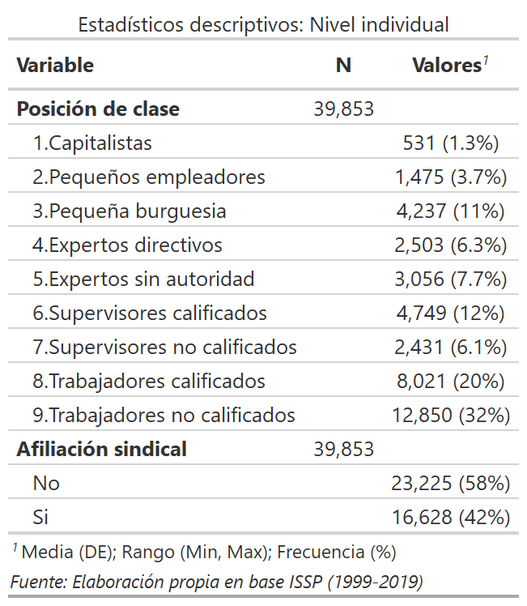
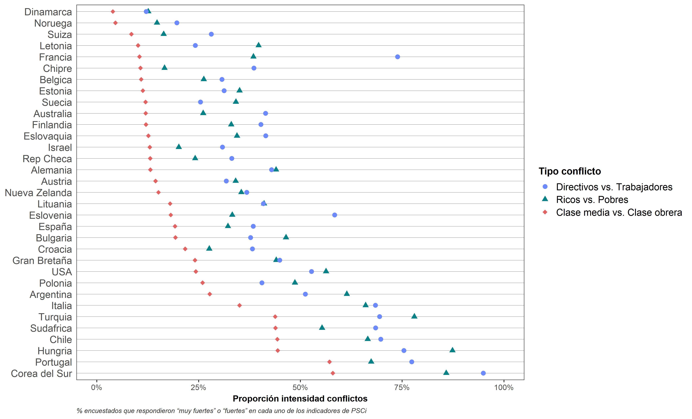

```{r database, message=TRUE, warning=TRUE, include=FALSE, paged.print=TRUE}

if (!require("pacman")) install.packages("pacman")

pacman::p_load(tidyverse, sjmisc, kableExtra, sjPlot,
               summarytools, DT, lme4, easystats, gtsummary, 
               stargazer, magrittr, htmlTable, gridExtra,
               influence.ME, janitor, lessR, ggrepel, ggpubr,
               performance, ggrepel, ggthemes, flexplot,
               sjlabelled, RColorBrewer, stats, car, texreg,
               scales, GGally, broom, table1, cowplot, ggeffects,knitr)

options(scipen=999)

load(url("https://github.com/Andreas-Lafferte/tesis/raw/main/output/data/db-proc.RData"))
load(url("https://github.com/Andreas-Lafferte/tesis/raw/main/output/data/df2-proc.RData"))

```

```{r include=FALSE}

table_format = if(is_html_output()) {
  "html"
} else if(is_latex_output()) {
  "latex"
}
table_format2 = if(is_html_output()) {
  T
} else if(is_latex_output()) {
  F
}

```

```{r setup, include=FALSE, eval=TRUE}
knitr::opts_chunk$set(comment=NA, prompt=FALSE, cache=FALSE, echo=TRUE, results='asis', message = F, warning = F)

options(htmltools.dir.version = FALSE)

summarytools::st_options(bootstrap.css     = FALSE,
           plain.ascii       = FALSE,   
           style             = "rmarkdown",
           dfSummary.silent  = TRUE, 
           footnote          = NA,
           subtitle.emphasis = FALSE,
           headings =  F,
           lang =  "es")

summarytools::st_css()

options(kableExtra.html.bsTable = T)

options(knitr.kable.NA = '')

reset_gtsummary_theme()
theme_gtsummary_journal(journal = "jama")
#> Setting theme `JAMA`
theme_gtsummary_compact()
#> Setting theme `Compact`
theme_gtsummary_language(language = "es", decimal.mark = ".", big.mark = ",", set_theme = T)

formatter <- function(...){
  function(x) format(round(x, 1), ...)
}

windowsFonts(`Roboto Condensed` = windowsFont("Roboto Condensed"))

my_pretty_theme <- theme_minimal(base_family = "Roboto Condensed", base_size = 10) +
  theme(panel.grid.minor = element_blank(),
        # Bold, bigger title
        plot.title = element_text(face = "bold", size = rel(1.7)),
        # Plain, slightly bigger subtitle that is grey
        plot.subtitle = element_text(face = "italic", size = rel(0.85), color = "grey30"),
        # Italic, smaller, grey caption that is left-aligned
        plot.caption = element_text(face = "italic", size = rel(0.7), 
                                    color = "grey70", hjust = 0),
        # Bold legend titles
        legend.title = element_text(face = "bold", size = rel(0.7)),
        # Bold, slightly larger facet titles that are left-aligned for the sake of repetition
        strip.text = element_text(face = "bold", size = rel(0.7), hjust = 0.5),
        # Bold axis titles
        axis.title = element_text(face = "bold", size = rel(0.85)),
        # Add some space above the x-axis title and make it left-aligned
        axis.title.x = element_text(margin = margin(t = 5)),
        # Add some space to the right of the y-axis title and make it top-aligned
        axis.title.y = element_text(margin = margin(r = 5)),
        # Add a light grey background to the facet titles, with no borders
        strip.background = element_rect(fill = "grey90", color = NA),
        # Add a thin grey border around all the plots to tie in the facet titles
        panel.border = element_rect(color = "grey90", fill = NA))

```

```{r xaringanExtra, echo=FALSE}
xaringanExtra::use_xaringan_extra(c("tile_view", "animate_css", "share_again", "scribble"))
```


```{r, message=FALSE, warning=FALSE, include=FALSE, results='asis'}

# Null model
model_0 <- lmer(PSCi ~ 1 + (1 | COUNTRY), 
                data = db, weights = FACTOR, REML = T)

performance::icc(model_0, by_group = T)
## ICC Country = 0.217
## ICC Individual = 0.783


# Influence test
inf_m0 <- influence(model_0, group = "COUNTRY")

# D cook
cooks.distance(inf_m0) # cut point is 4/33 = 0.1212121

plot(inf_m0, which="cook",
     cutoff=0.121, sort=TRUE,
     xlab="Distancia de Cook",
     ylab="País", width=60, height=40)

# Influential countries: South Korea and Hungary. 
# This are the two countries with the highest average PSCi in the sample.


# Model 1: Only Class
model_1 <- lmer(PSCi ~ 1 + CLASS +
                  (1 | COUNTRY), data = db, weights = FACTOR, REML = T)

# Model 2: Class + Union
model_2 <- lmer(PSCi ~ 1 + CLASS + UNION +
                  (1 | COUNTRY), data = db, weights = FACTOR, REML = T)

# Model 3: Class + Union + Ratio + CorpAll + WAVE
model_3 <- lmer(PSCi ~ 1 + CLASS + UNION + C_RATIO + CorpAll + WAVE +
                  (1 | COUNTRY), data = db, weights = FACTOR, REML = T)

# Model 4: Class + Union + Ratio + CorpAll + WAVE + Controls N1 & N2
model_4 <- lmer(PSCi ~ 1 + CLASS + UNION + C_RATIO + CorpAll + WAVE +
                  (C_AGE)^2 + SEX + IDEOLOGY + C_SOCEXPEND +
                  (1 | COUNTRY), data = db, weights = FACTOR, REML = T)

# Model 5: Class + Union + Ratio + CorpAll + WAVE + Controls N1 & N2 + Random Slope CLASS
model_5 <- readRDS("~/GitHub/tesis/output/model_5.rds")

# Model 6: Class + Union + Ratio + CorpAll + WAVE + Controls N1 & N2 + Random Slope CLASS + Interaction
model_6 <- readRDS("~/GitHub/tesis/output/model_6.rds")


## Extract for table
model_2.e <- texreg::extract(model = model_2, include.deviance = T, include.loglik = F,
                     include.variance = F)

model_3.e <- texreg::extract(model = model_3, include.deviance = T, include.loglik = F,
                     include.variance = F)

model_4.e <- texreg::extract(model = model_4, include.deviance = T, include.loglik = F,
                     include.variance = F)

model_6.e <- readRDS("~/GitHub/tesis/output/model_6e.rds")

```


class: middle hide-logo title

.pull-left-narrow[
.espaciosimple[
.tiny[]
]


<br><br><br><br><br>
]

.pull-right-wide[
.right[

.content-box-red[
.center[

## Ellos contra nosotros: las percepciones del conflicto social

.medium[

### Un análisis comparado de sus determinantes
]
]
]

.medium[.red[### Exámen para optar al título de Sociólogo]]


----
.espaciosimplelineas[

.medium[.bold[Andreas Lafferte Tamayo]] .tiny[.blue[(_andreas.laffert@ug.uchile.cl_)]]

]


.small[
Facultad de Ciencias Sociales, Universidad de Chile
]
.small[
Enero, Santiago.

  ]

]
]

</br>
.left.tiny[Profesor Guía: Dr. Juan Carlos Castillo </br>
Comisión:  ]
---
class: inverse middle center, slideInRight

.medium[ 
### Estructura de presentación
]


.medium[ 
1. Introducción
2. Método
3. Resultados
4. Discusión y conclusiones
5. Respuesta a comentarios
]


---

layout: true
class: animated, fadeIn
---
class: inverse middle center, slideInRight
background-size: 12%
background-position: 99% 1%

## 1. Introducción


---

<div style="text-align: justify">
# Social comparison and subjective status

* How do individuals .bold[perceive] themselves in the social hierarchy?

* .bold[Social comparison] (Festinger, 1954) and .bold[reference groups] (Merton, 1968) 

* _avaliability heuristic_ mechanism: a "social closure" generated by .bold[homophily] and .bold[homogeneity] of reference groups led to biased estimations (Evans, 2004)


---

<div style="text-align: justify">
# Social comparison and subjective status

* How do individuals .bold[perceive] themselves in the social hierarchy?

* .bold[Social comparison] (Festinger, 1954) and .bold[reference groups] (Merton, 1968) 

* _avaliability heuristic_ mechanism: a "social closure" generated by .bold[homophily] and .bold[homogeneity] of reference groups led to biased estimations (Evans, 2004)


---
class: inverse middle center, slideInRight
background-size: 12%
background-position: 99% 1%

## 2. Método

---


# Datos y método

<div style="text-align: justify">

--


.medium[
- .bold[Datos]: Módulo de Desigualdad Social de la [International Social Survey Programme (ISSP)](https://www.gesis.org/en/issp/modules/issp-modules-by-topic/social-inequality) en sus olas de 1999 (*N* = 6.175), 2009 (*N* = 21.932) y 2019 (*N* = 11.746) además de otras fuentes de datos como  [OCDE](https://data.oecd.org/economy.htm#profile-GDP%20and%20spending), [WIID](https://www.wider.unu.edu/database/world-income-inequality-database-wiid#WIIDcomp) e [ICTWSS](https://www.ictwss.org/). Muestra final compuesta por 39.853 individuos (nivel 1) anidados en 33 países (nivel 2).
]
--

</br>

.medium[
- .bold[Método]: Modelos de regresión multinivel en series de tiempo o tendencia para 33 países entre 1999/2009/2019.

.center[
.bold[Modelo]:

$PSCi_{ij} = \beta_{0} + \beta_{1}X_{ij} + \beta_{2}Z_{j} + \beta_{3}X_{ij}{Z}_{j} +$
$u_{0j} + u_{1j}X_{ij} + e_{ij}$
]

]
---
## Variable dependiente 


<div style="text-align: justify">

.medium[
.bold[Perceived Social Conflict Index] - $PSCi$: índice sumativo de tres indicadores sobre la percepción de conflictos. Sus valores oscilan entre 0 a 9 ( $\alpha$ = 0.83), *M* = 3.78, *DE* = 2.03.

]

.center[

]


---
## Variables independientes

<div style="text-align: justify">
.pull-left[

.small[
**Nivel individual**

- .bold[Posición de clase]: medida a partir de una versión modificada de 9 categorías del esquema de clases de Erik Olin Wright (1997).

</br>

- .bold[Afiliación sindical]: variable dummy (0 = no miembro de sindicato, 1 = miembro de sindicato).


]
]

.pull-right[

.center[

]
]

---
## Variables independientes

<div style="text-align: justify">

.pull-left[

.small[
**Nivel contextual (país-año)**

- .bold[Desigualdad económica]: medida a través del ratio inter quintil S80/S20 sobre el ingreso familiar disponible post transferencias y post impuestos (concentración económica).

- .bold[Nivel de corporativismo]: medido a través del índice desarrollado por Jahn (2016) a partir de la base de datos de Visser (2019) ICTWSS. 

- .bold[Tiempo]: medido como el año de aplicación de la encuesta (1999, 2009 o 2019)

]
]

.pull-right[

.center[

]
]


---
## Controles

<div style="text-align: justify">

.pull-left[

.small[
**Nivel individual**

- Edad (en años)
- Sexo (*dummy* 0 = Hombre, 1 = Mujer)
- Identificación política (*nominal politómica* Derecha, Centro, Izquierda, Sin identificación)

**Nivel contextual**

- Producto Interno Bruto (GDP) per cápita (en USD)
- Gasto social como proporción del GDP

]
]

.pull-right[

.center[

]
]
---
class: inverse middle center, slideInRight
background-size: 12%
background-position: 99% 1%

## 3. Resultados

---
### Descriptivos - Evolución percepciones conflicto social 1999-2019


.center[

]

---
### Descriptivos - Intensidad percepción conflictos entre grupos

.center[


]


---
### Modelos - Interceptos aleatorios

.center[

]


---
### Modelos - Interceptos aleatorios

.center[


]

.left.tiny[
.bold[
H1: ✓
]]


---
### Modelos - Interceptos aleatorios

.center[


]

.left.tiny[
.bold[
H1: ✓
H2: ✓
]

]


---
### Modelos - Interceptos aleatorios

.center[


]

.left.tiny[
.bold[
H1: ✓
H2: ✓
H3a: ✓
]

]
---
### Modelos - Interceptos aleatorios

.center[


]

.left.tiny[
.bold[
H1: ✓
H2: ✓
H3a: ✓
H4: ✓
]

]
---
### Modelos - Interceptos aleatorios

.center[


]

.left.tiny[
.bold[
H1: ✓
H2: ✓
H3a: ✓
H3b: ✗
H4: ✓
]

]
---
### Modelos - Interacciones entre niveles

.center[


]


---
class: inverse middle center, slideInRight
background-size: 12%
background-position: 99% 1%

## 4. Discusión y conclusiones

---
Hola
---
class: inverse middle center, slideInRight
background-size: 12%
background-position: 99% 1%

## 5. Respuesta a comentarios

---

Hola

---
### Referencias

---
class: inverse middle center, slideInRight
background-size: 12%
background-position: 99% 1%

## 6. Anexos

---
### Descriptivos

.center[


]

---
### Descriptivos

.center[


]


---
### Descriptivos

.center[


]

---
### Modelos

.center[


]


---
### Modelos

.center[


]


---
### Modelos

.center[


]


---
### Modelos 

.center[


]

---
### Ajuste modelos

</br>

```{r fit, echo=FALSE, message=FALSE, warning=FALSE, cache=TRUE, results='asis'}

res_anova <- readRDS("~/GitHub/tesis/output/deviancetest.rds")

fit_tab <- res_anova[c(2,3,5,6,7)] %>% as.tibble(.)

fit_tab$mod <- c("Modelo 0", "Modelo 1", "Modelo 2", "Modelo 3", "Modelo 4")
fit_tab$p <- c(" ","< 0.001 ***", "< 0.001 ***", "< 0.001 ***", "< 0.01 **")
fit_tab$Chisq <- round(fit_tab$Chisq, digits = 2)

fit_tab <- fit_tab %>% select(mod, AIC, BIC, deviance, Chisq, Df, p)

colnames <- c("Modelo", "AIC", "BIC", "Deviance", "$\\chi^2$", "Df", "p-value")

fit_tab <- kableExtra::kable(fit_tab, format = "html", col.names = colnames, row.names = F,
                  booktabs = T, caption = "Estadísticos de bondad de ajuste") %>% 
  kableExtra::kable_styling(latex_options = "hold_position", font_size = 16, position = "center") %>%
   kableExtra::kable_styling(bootstrap_options = c("striped", "hover", "condensed", "responsive"), full_width = T) %>% 
  footnote(number = c("Modelo 0 refiere al modelo nulo o sin predictores"))

fit_tab

```

---
### Matriz correlaciones

.center[

]

---
### Supuestos: multicolinealidad


.center[


]

---
### Supuestos: DFBetas


```{r dfbetas, echo=FALSE, message=FALSE, warning=FALSE, cache=TRUE, results='asis', fig.align='center'}
library(influence.ME)

# Model 3: Class + Union + Ratio + CorpAll + WAVE
model_3 <- lmer(PSCi ~ 1 + CLASS + UNION + C_RATIO + CorpAll + WAVE +
                  (1 | COUNTRY), data = db, weights = FACTOR, REML = T)

inf_m3 <- influence(model_3, group = "COUNTRY")

cutdfbeta <- 2/sqrt(33)

plot(inf_m3, which = "dfbetas", cutoff = cutdfbeta, 
     sort = TRUE, to.sort = 14, parameters = 13:14,
     xlab = "DFBETAS", ylab = "País", width=60, height=40) 

```


